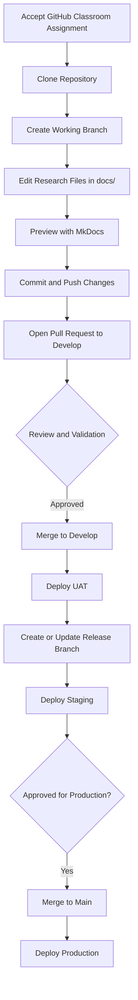

# 📘 Research Website Template

This repository is a modular research website template built with:

- **Markdown** for writing and versioning content
- **MkDocs + Material** for local preview and web publishing
- **GitHub** for collaboration and progress tracking
- **GitHub Actions** for validation and deployment

The research site is organized by chapter and section so teams can write, review, and publish content without working in one large document.

The template supports the standard BSCS research workflow for either a capstone project or a thesis. In this repository, both are treated as research outputs under the same institutional framework.

This repository is distributed to students through a GitHub Classroom assignment, so each student or group starts from an assigned repository before cloning it locally.

The template is designed to work together with the institutional research manual. Students should use the manual for policy, workflow, and evaluation rules, and use this repository as the working website and appendix structure.

---

# 📁 Project Structure

All research website content lives in the `docs/` directory.

```text
docs/
├── index.md
├── 01-chapter-1-introduction/
│   ├── a-project-context.md
│   ├── b-purpose-and-description.md
│   ├── c-objectives-rq-alignment.md
│   └── d-scope-and-limitation.md
├── 02-chapter-2-related-literature/
│   ├── a-domain-literature.md
│   ├── b-synthesis-matrix.md
│   └── c-technical-gap.md
├── 03-chapter-3-methods/
│   ├── a-institutional-framework.md
│   ├── b-product-backlog.md
│   ├── c-sprint-structure.md
│   ├── d-definition-of-done.md
│   ├── e-system-architecture.md
│   ├── f-logic-flow.md
│   ├── g-data-schema.md
│   └── h-validation-plan.md
├── 04-chapter-4-results/
│   ├── a-scrum-execution.md
│   ├── b-features-and-outputs.md
│   ├── c-ci-cd-results.md
│   ├── d-system-testing-results.md
│   ├── e-code-coverage-results.md
│   ├── f-security-verification-results.md
│   └── g-validation-results.md
├── 05-chapter-5-discussion/
│   ├── a-summary-of-key-findings.md
│   ├── b-conclusions.md
│   ├── c-limitations.md
│   └── d-recommendations.md
├── 06-appendices/
│   ├── a-cv/
│   │   ├── member1.md
│   │   └── member2.md
│   ├── b-topic-mine/
│   │   ├── member1.md
│   │   └── member2.md
│   ├── c-title-proposal-and-problem-statement-form.md
│   ├── d-comparative-summary.md
│   ├── e-gate-1-title-defense.md
│   ├── f-tech-stack.md
│   ├── g-sprint-0-retrospective.md
│   ├── h-sprint-0-review-and-sprint-1-planning.md
│   ├── i-gate-2-proposal-defense.md
│   ├── j-sprint-1-retrospective.md
│   ├── k-sprint-1-review-and-sprint-2-planning.md
│   ├── l-sprint-2-retrospective.md
│   ├── m-sprint-2-review-and-sprint-3-planning.md
│   ├── n-sprint-3-retrospective.md
│   ├── o-sprint-3-review-and-final-sprint-planning.md
│   ├── p-gate-3-pre-defense.md
│   ├── q-raw-seq-and-sus-data.md
│   ├── r-final-sprint-retrospective.md
│   ├── s-final-sprint-review.md
│   └── t-gate-4-final-defense.md
├── img/
└── src/
```

The current template starts directly with the site home page and numbered chapter folders. It does not use a separate front-matter directory.

This structure keeps the research website:

- Modular
- Easier to review
- Easier to maintain
- Ready for web publication
- Easy to browse as a site instead of a print-first document

For Chapter 4, Epic 4 User Stories 1 to 6 are treated as recurring sprint-reporting artifacts. Teams should update those result areas for each completed sprint, including the final sprint when applicable, while keeping the formal final defense in its own gate appendix rather than treating it as another recursive sprint record.

---

# 🚀 Getting Started

## 1. Accept and Clone Your Classroom Repository

```bash
git clone https://github.com/<your-username>/<your-repo>.git
cd <your-repo>
```

Before cloning, accept the GitHub Classroom assignment link provided by your instructor.

## 2. Install Requirements

```bash
python -m venv .venv
.venv\Scripts\activate
pip install mkdocs mkdocs-material
```

On macOS or Linux, activate the environment with `source .venv/bin/activate` instead.

## 3. Start Writing

Edit the Markdown files inside `docs/`.

Most chapter pages now include structured scaffolds. Replace the guide text with project-specific content as the website develops.

Use these folders consistently:

- `docs/` for research chapters, appendices, and published pages
- `docs/img/` for screenshots, diagrams, and figures
- `docs/src/` for source code, scripts, datasets, or supporting files

## 4. Preview Locally

```bash
mkdocs serve
```

Open `http://127.0.0.1:8000/` in your browser.

---

# ✍️ Suggested Writing Flow

1. Update the relevant section in `docs/`
2. Preview changes locally with `mkdocs serve`
3. Commit only related edits
4. Push your branch and open a pull request

Example commit flow:

```bash
git add .
git commit -m "docs: update chapter 1 objectives"
git push
```

---

# 🤝 Collaboration Workflow

## 1. Create a Working Branch

```bash
git checkout -b doc/<issue-number>-<short-description>-<username>
```

If `develop` already exists in the repository, create the branch from `develop` so your pull request target stays aligned with the documented workflow.

Examples:

- `doc/12-write-project-context-juan`
- `doc/18-update-methods-maria`
- `doc/21-fix-chapter-3-typos-ken`

Branch roles:

- `doc/*` for regular writing, revisions, and content updates
- `develop` for the latest integrated version deployed to UAT
- `release/<name>` for staging-ready versions
- `main` for approved production content

## 2. Write Clear Commit Messages

```text
feat: add system architecture diagrams
fix: correct grammar in introduction
docs: update abstract and validation plan
```

## 3. Keep Pull Requests Focused

Do not combine unrelated changes in one pull request.

## 4. Open a Pull Request

For regular work, open the pull request against `develop`.

Promotion flow:

1. Merge `doc/*` or `rev/*` into `develop`
2. Create or update `release/<name>` from `develop`
3. Merge to `main` only after the required release-related review and approval

For release-related merges to `main`, the normal institutional expectation is review by both the adviser and the research coordinator.

## 5. Sync Before Starting New Work

If your repository tracks an upstream classroom or template repository:

```bash
git pull upstream develop
```

If not, sync from your default remote instead:

```bash
git pull origin develop
```

---

# 🌐 Deployment Overview

GitHub Actions automatically validates pull requests and deploys the MkDocs site when supported branches are updated.

Deployment targets:

- `main` deploys the production site from the root of `gh-pages`
- `develop` deploys the UAT site to `gh-pages/uat`
- `release/<name>` deploys a staging site to `gh-pages/<name>`

Examples:

- `release/sprint-0` deploys to `gh-pages/sprint-0`
- `release/final-demo` deploys to `gh-pages/final-demo`

Pull requests to `main` and `develop` are validated before merge. Pushes to `main`, `develop`, and `release/*` trigger deployment.

## One-Time GitHub Pages Setup

After the first deployment:

1. Go to **Settings**
2. Open **Pages**
3. Under **Build and deployment**:
   - Set **Source** to `Deploy from a branch`
   - Set **Branch** to `gh-pages`
   - Set **Folder** to `/ (root)`
4. Save the settings

Published URLs follow this pattern:

```text
Production: https://<username>.github.io/<repository-name>/
UAT:        https://<username>.github.io/<repository-name>/uat/
Staging:    https://<username>.github.io/<repository-name>/<release-name>/
```

---

# 🔄 Student Workflow Diagram



---

# ✅ Summary

This template gives you:

- A chapter-based research structure
- Student-facing scaffolds for the main website sections
- A clean Markdown authoring workflow
- Local preview with MkDocs
- Team collaboration through Git and pull requests
- Automated validation and GitHub Pages deployment
