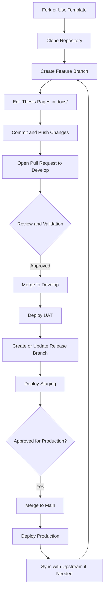

# 📘 Thesis Documentation Template (Markdown + MkDocs)

Welcome to the **Thesis Documentation Template** — a modern, modular, and GitHub-friendly way to write your thesis using:

- **Markdown** for clean writing  
- **MkDocs + Material theme** for beautiful documentation  
- **GitHub + GitHub Pages** for tracking progress and publishing  
- **GitHub Actions** for validating and deploying automatically  

This template follows a **standard academic thesis format** and breaks every section into separate Markdown files for clarity and maintainability.

---

# 📦 How to Use This Repository

This repository is configured as a **Template Repository** on GitHub and distributed via GitHub Classroom activity. Setup is configured for the students to use.

### ✅ 3. Clone your newly created repository

```bash
git clone https://github.com/<your-username>/<your-repo>.git
```

### ✅ 4. Start editing your Markdown files inside the `docs/` folder

When finished editing:

```bash
git add .
git commit -m "Add Chapter 1 Introduction"
git push
```

---


# 📁 Repository Structure

Your thesis content lives entirely inside the `docs/` directory:

```
docs/
│
├── index.md
│
├── 01-front-matter/
│   ├── title-page.md
│   ├── abstract.md
│   ├── table-of-contents.md
│   ├── list-of-figures.md
│   ├── list-of-tables.md
│   └── list-of-notations.md
│
├── 02-introduction/
│   ├── project-context.md
│   ├── purpose-and-description.md
│   ├── objectives.md
│   └── scope-and-limitations.md
│
├── 03-related-literature/
│   └── related-literature.md
│
├── 04-technical-background/
│   └── technical-background.md
│
├── 05-design-and-methodology/
│   ├── conceptual-design.md
│   ├── system-architecture.md
│   ├── block-diagrams.md
│   └── algorithms.md
│
├── 06-results-and-discussion/
│   └── results-and-discussion.md
│
├── 07-conclusions-and-recommendations/
│   └── conclusions-and-recommendations.md
│
├── 08-appendices/
│   ├── source-code.md
│   ├── evaluation-tools.md
│   ├── sample-input-output.md
│   ├── user-guide.md
│   └── cv/
│       ├── member1.md
│       └── member2.md
│
├── img/
└── src/
```

This structure ensures your thesis is:

✔ Modular  
✔ Easy to manage  
✔ Easy to review  
✔ Ready for publication  

---

# 🧩 Requirements

Install MkDocs and the Material theme:

```bash
pip install mkdocs mkdocs-material
```

---

# ▶️ Local Preview

To preview your thesis website locally:

```bash
mkdocs serve
```

Open:

```
http://127.0.0.1:8000/
```

---

# 🌐 GitHub Pages Deployment

This project is designed to be published online using **GitHub Pages** and **MkDocs**.

---

## ✅ 1. Push your repository to GitHub

If you haven’t yet:

```bash
git add .
git commit -m "Initial commit"
git push
```

---

## ✅ 2. Automatic Deployment

This template includes a **GitHub Actions workflow** that automatically validates pull requests and deploys your MkDocs site when changes are pushed to the supported deployment branches.

The workflow will:

1. Build your MkDocs site  
2. Push the output to the `gh-pages` branch  
3. Update the correct GitHub Pages target for the branch  

Deployment targets:

- `main` → production site at the root of `gh-pages`
- `develop` → UAT site in `gh-pages/uat`
- `release/<name>` → staging site in `gh-pages/<name>`

Examples:

- `release/sprint-0` → `gh-pages/sprint-0`
- `release/final-demo` → `gh-pages/final-demo`

Pull requests to `main` and `develop` are validated automatically before merge. Pushes to `main`, `develop`, and `release/*` trigger deployment.

---

## ✅ 3. One-Time Setup on GitHub Pages

After your first deployment:

1. Go to **Settings**
2. Select **Pages**
3. Under *Build & Deployment*:
   - **Source:** Deploy from a branch
   - **Branch:** `gh-pages`
   - **Folder:** `/ (root)`
4. Save

Your thesis will be published at:

```text
Production: https://<username>.github.io/<repository-name>/
UAT:        https://<username>.github.io/<repository-name>/uat/
Staging:    https://<username>.github.io/<repository-name>/<release-name>/
```

---

# 🤝 Contribution Guidelines

Follow this workflow for clean collaboration:

---

## 1️⃣ Create a Feature Branch

```bash
git checkout -b doc/<your-topic>
```

Examples:

- `doc/add-abstract`
- `doc/update-methodology`
- `rev/typo-chapter3`

Branch usage:

- `doc/*` for day-to-day writing and corrections
- `develop` for the latest integrated work deployed to UAT
- `release/<name>` for a staging-ready snapshot deployed to a named staging directory
- `main` for approved production content

---

## 2️⃣ Write Clear Commit Messages

```
feat: add system architecture diagrams
fix: correct grammar in introduction
docs: update abstract formatting
```

---

## 3️⃣ Keep Pull Requests Small  
Do not mix unrelated edits.

---

## 4️⃣ Open a Pull Request

1. Push your branch  
2. Open a Pull Request to `develop` for regular work  
3. Describe your changes  
4. Submit  

Promotion flow:

1. Merge `doc/*` or `rev/*` into `develop` to update UAT
2. Create or update `release/<name>` from `develop` to publish a staging version
3. Merge to `main` when the release is approved for production

---

## 5️⃣ Sync Before Working Again

```bash
git pull upstream develop
```

---

# 🔄 Student Workflow Diagram



---

# ✍️ Editing Your Thesis

Modify content inside:

```
docs/
```

Images go inside:

```
docs/img/
```

Source code, scripts, datasets go inside:

```
docs/src/
```

---

# 🎉 You're Ready!

You now have a complete **Thesis Documentation Template** with:

✔ Clean academic structure  
✔ Markdown-based writing  
✔ Auto-validation on PRs  
✔ Auto-deployment to GitHub Pages  
✔ Template-based student workflow  
✔ Optional upstream sync  
✔ Visual contribution diagram  
