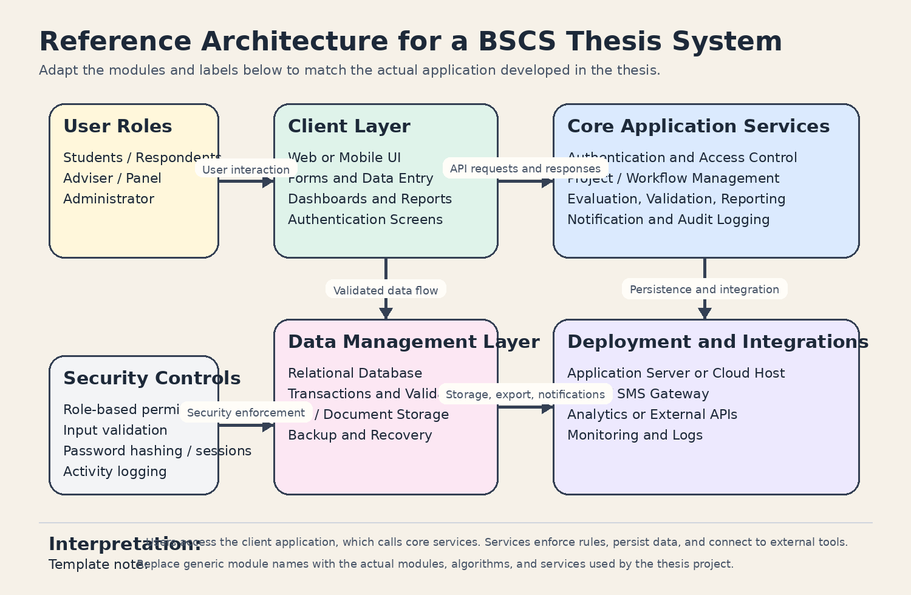

# System Architecture

This section presents a reference system architecture for a typical BSCS research project that delivers a web-based or mobile-supported application. The diagram below is intentionally written as a reusable baseline: students should replace the module names with the actual services, actors, and deployment components used by their study.

## Architectural Overview

The reference architecture is organized into five major parts:

- User roles, which represent the people who directly interact with the system
- Client layer, which contains the user interface for data entry, dashboards, reports, and login flows
- Core application services, which enforce the business rules and execute the main project logic
- Data management layer, which stores operational records, generated reports, and uploaded files
- Deployment and integrations, which support hosting, notifications, logging, and external services

This layered arrangement keeps presentation, processing, and persistence concerns separate. That separation improves maintainability, makes testing easier, and allows the project to evolve without tightly coupling every feature to a single module.

## Component Description

### 1. User Roles

The architecture assumes three common actors: students or respondents, faculty users such as advisers or panel members, and administrators. In an actual research implementation, these roles may be renamed depending on the domain. For example, a healthcare project may use patients and clinicians, while an inventory project may use staff and managers.

### 2. Client Layer

The client layer is responsible for collecting input and presenting system output. It may be implemented as a browser-based interface, a mobile application, or a hybrid frontend. Typical client responsibilities include:

- User authentication
- Form submission
- Record browsing and search
- Dashboard and report viewing
- Feedback and validation prompts

### 3. Core Application Services

The core application layer contains the main processing logic of the project. In a completed research project, this is the layer where the study's algorithm, workflow engine, decision rules, or analytics module should be placed. Typical services include:

- Authentication and access control
- Business rules and validation
- Project-specific processing or classification logic
- Report generation
- Notification handling
- Audit trail recording

### 4. Data Management Layer

The data layer stores the information needed by the system during normal operation. This commonly includes structured records in a relational database and unstructured files such as attachments, exports, or generated documents. Backup and recovery mechanisms should also be described here if they are part of the system scope.

### 5. Deployment and Integrations

The final layer describes where the system runs and what outside services it depends on. Depending on the approved scope, this may include a cloud host, on-premise server, email gateway, SMS provider, or third-party API.

## Data Flow Summary

The expected interaction flow is as follows:

1. A user submits a request through the client interface.
2. The client forwards the request to the application layer.
3. The application layer validates the request, applies business rules, and executes the required process.
4. Processed data is saved in the database or file storage.
5. The application may trigger notifications, reporting, or external integrations.
6. The result is returned to the client for display to the user.

## Adaptation Guide

Before final submission, revise this section so it matches the actual research project. At minimum, replace the generic labels in the figure and text with the following project-specific details:

- Actual system users
- Actual frontend technology
- Actual backend framework or processing module
- Actual database or storage platform
- Actual external services and deployment target

If the research project includes a machine learning model, optimization algorithm, or decision support component, it should be explicitly named under the core application services subsection.

---
[⬅️ Previous](d-definition-of-done.md) | [Next ➡️](f-logic-flow.md)
